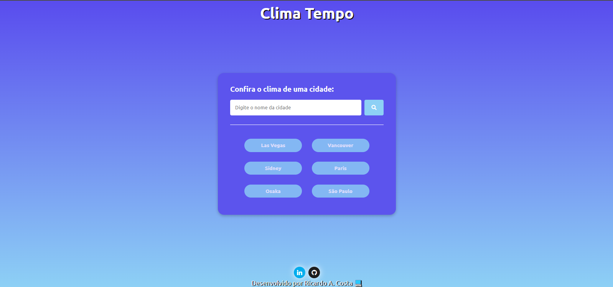

<h1 align="center"> App Clima Tempo </h1>

App Desenvolvida para pesquisar condições Climaticas do Tempo.

  <a href="#-tecnologias">Tecnologias</a>&nbsp;&nbsp;&nbsp;|&nbsp;&nbsp;&nbsp;
  <a href="#-projeto">Projeto</a>&nbsp;&nbsp;&nbsp;|&nbsp;&nbsp;&nbsp;
  <a href="#-layout">Layout</a>&nbsp;&nbsp;&nbsp;|&nbsp;&nbsp;&nbsp;
  <a href="#memo-licença">Licença</a>

  
<h2 align="center">Clima Tempo</h2>

🌎🌞🌨☔🌈

 

  

## 🚀 Tecnologias

Esse projeto foi desenvolvido com as seguintes tecnologias:

- HTML e CSS
- JavaScript
- Git e Github

## 💻 Projeto

Este Projeto Clima Tempo foi desenvolvido atraves do Programa Hora de Codar de Matheus Battisti, com Finalilade de  pesquisar as condições Climaticas em Tempo Real, utilizando a Api openweather.  
Além de fazer parte da metodologia de ensinar e treinar as Habilidades de tecnologias WEB para quem esta em inicio de carreira !

## 🔖 Layout

Você pode visualizar o layout do projeto através [DESSE LINK](https://calculadoragorgetas.netlify.app/)
## :memo: Licença

Esse projeto está sob a licença MIT.

---

Feito com ♥ by Ricardo A Costa 💻